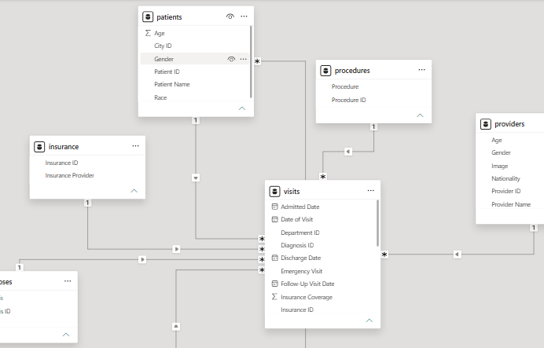
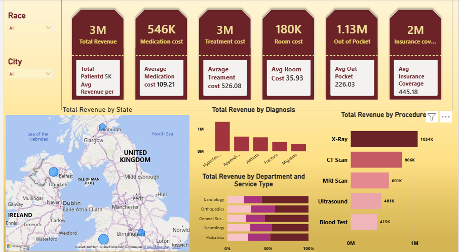
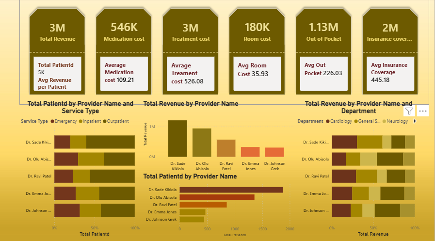
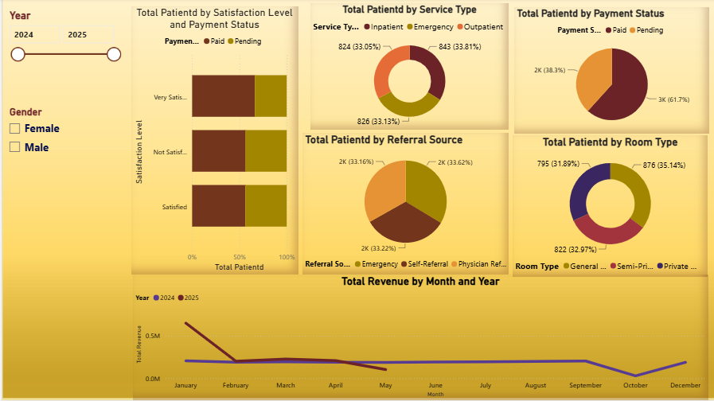

# 🏥 Healthcare Data Analysis – Power BI

## 📌 Project Overview

This project is a comprehensive Healthcare Data Analysis and Interactive Dashboard developed using Microsoft Power BI.

The project analyzes healthcare data from multiple related tables to provide insights into:

- Financial performance
- Patient information
- Provider performance
- Healthcare services
- Diagnoses and procedures
- Departments
- Insurance coverage
- Payment status
- Patient satisfaction
- Revenue trends
- Geographic revenue distribution

The project includes three interactive dashboards and a comprehensive data model containing eight related tables.

---

## 🛠️ Tools & Skills

- Microsoft Power BI
- DAX
- Data Modeling
- Data Relationships
- Calculated Columns
- DAX Measures
- KPI Analysis
- Data Visualization
- Interactive Dashboards
- Slicers & Filtering
- Map Visualization
- Financial Analysis
- Patient Analysis
- Provider Performance Analysis
- Healthcare Analytics
- Business Intelligence

---

## 🗂️ Data Model

The Power BI data model contains 8 related tables:

1. Patients
2. Providers
3. Visits
4. Procedures
5. Diagnoses
6. Departments
7. Insurance
8. Cities

The tables are connected through relationships to support integrated analysis across patients, providers, healthcare services, financial information, and geographic data.

### 📊 Data Model

---

# 💰 Dashboard 1 – Financial Overview

The Financial Overview dashboard focuses on the financial performance of the healthcare organization.

### Key Metrics

The dashboard includes financial KPIs such as:

- Total Revenue
- Medication Cost
- Treatment Cost
- Room Cost
- Out of Pocket
- Insurance Coverage

### Financial Analysis

The dashboard provides analysis of:

- Revenue by State
- Revenue by City
- Revenue by Diagnosis
- Revenue by Procedure
- Revenue by Department
- Revenue by Service Type

### Interactive Filtering

Users can filter the financial analysis using slicers for:

- Race
- City

### Geographic Analysis

A Map Visualization was created to display Total Revenue by City, providing a geographic view of revenue distribution.

### 📊 Financial Dashboard

---

# 👨‍⚕️ Dashboard 2 – Providers Insight

The Providers Insight dashboard focuses on provider activity and performance.

### Analysis Includes

- Total Patients by Provider
- Total Revenue by Provider
- Provider Performance by Service Type
- Provider Performance by Department
- Provider Activity Comparison
- Provider Revenue Comparison

This dashboard allows users to compare provider performance and understand how different providers contribute to patient activity and revenue.

### 📊 Providers Dashboard

---

# 🧑‍⚕️ Dashboard 3 – Patient & Service Analysis

The Patient & Service Analysis dashboard focuses on patient characteristics, healthcare services, payment information, and revenue trends.

### Analysis Includes

- Patients by Satisfaction Level
- Patients by Payment Status
- Patients by Service Type
- Payment Status
- Referral Source
- Room Type
- Revenue by Month
- Revenue by Year

### Interactive Filtering

Slicers were created for:

- Year
- Gender

These filters allow users to dynamically explore patient and service-related information.

### 📊 Patient & Service Dashboard

---

# 📈 Analysis Areas

The project provides analysis across several healthcare business areas:

### Financial Analysis
- Revenue performance
- Treatment costs
- Medication costs
- Room costs
- Insurance coverage
- Out-of-pocket payments
- Revenue by geographic location

### Patient Analysis

- Patient demographics
- Gender
- Race
- Satisfaction levels
- Payment status
- Referral sources
- Patient-level details

### Provider Analysis

- Patient volume by provider
- Revenue by provider
- Provider performance
- Service type performance
- Department performance

### Healthcare Service Analysis

- Procedures
- Diagnoses
- Departments
- Service types
- Room types

### Time-Based Analysis

- Monthly revenue trends
- Yearly revenue trends

---

# 🔍 Key Features

- Interactive Power BI dashboards
- Eight-table healthcare data model
- Financial KPI analysis
- Patient analytics
- Provider performance analysis
- Revenue analysis
- Geographic revenue analysis using Map Visualization
- Race and City filtering
- Year and Gender filtering
- DAX Measures
- Calculated Columns
- Interactive data exploration

---

# 🔄 Analysis Workflow

`text
Healthcare Data
      ↓
Data Organization & Modeling
      ↓
Data Relationships
      ↓
DAX Measures & Calculated Columns
      ↓
KPI Analysis
      ↓
Interactive Filters & Slicers
      ↓
Drill Through
      ↓
Data Visualization
      ↓
Interactive Dashboards
      ↓
Healthcare Business Insights

# 📁 Project Files

### Power BI File

Healthcare-Data-Analysis.pbix

Contains the complete Power BI project, including:

- Data Model
- Eight related tables
- Relationships
- DAX Measures
- Calculated Columns
- Three Dashboard Pages
- Interactive Filters
- Visualizations

### Dashboard Images

- Healthcare-Financial-Dashboard.png
- Healthcare-Providers-Dashboard.png
- Healthcare-Patient-Service-Dashboard.png

### Data Model

- Healthcare-Data-Model.png

---

# 🎯 Project Objective

The main objective of this project is to transform healthcare data into an interactive Business Intelligence solution that helps analyze:

- Financial performance
- Patient behavior
- Provider performance
- Healthcare services
- Revenue trends
- Insurance and payment information
- Geographic revenue distribution

The project demonstrates practical experience in Power BI, DAX, Data Modeling, Interactive Visualization, and Healthcare Data Analysis.

---

# 💡 Project Type

Healthcare Data Analysis | Business Intelligence | Power BI Dashboard

---

⭐ This project is part of my Data Analyst Portfolio, demonstrating practical skills in data analysis, data modeling, DAX, visualization, and interactive dashboard development.
